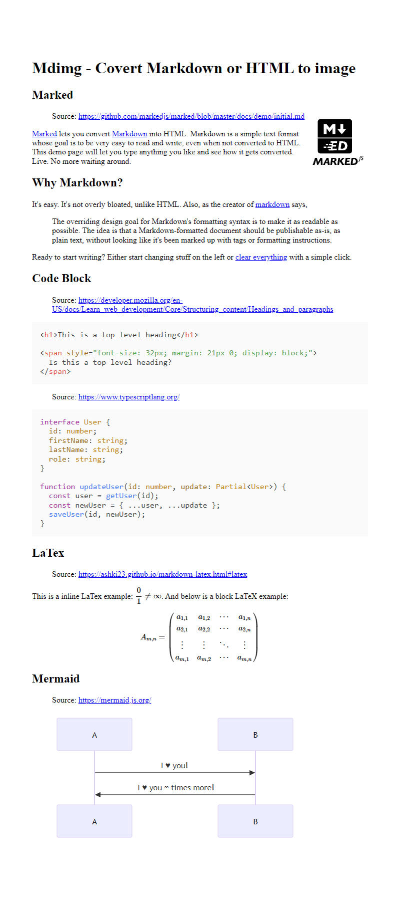
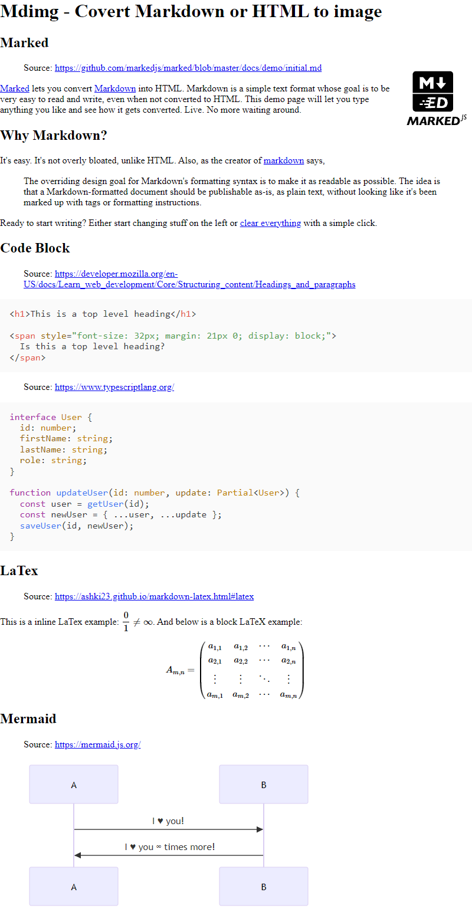
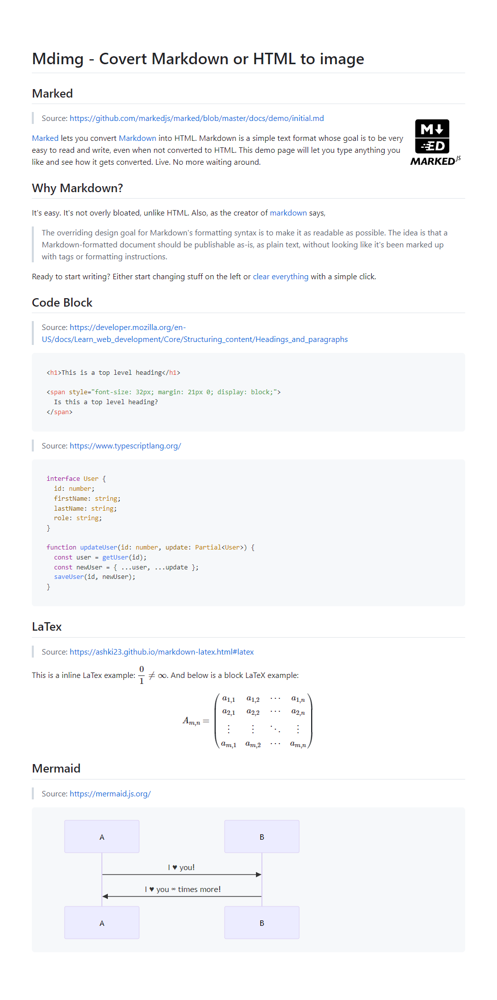

<a href="https://www.npmjs.com/package/mdimg" target="_blank"></a> <a href="https://www.npmjs.com/package/mdimg?activeTab=versions" target="_blank"></a> <a href="https://www.typescriptlang.org/" target="_blank"></a>

# mdimg

A tool that can be used to convert **Markdown** or **HTML** format text to an image.

## How does it work?

First, the script calls [marked](https://github.com/markedjs/marked) to parse Markdown into a HTML document. Next, use [Puppeteer](https://github.com/puppeteer/puppeteer) to start a headless browser and render the document with HTML and CSS templates. Finally, export our image through Puppeteer's [screenshot](https://pptr.dev/guides/screenshots/) API.

## Preview

Rendering results:

| MacOS                                                                           | Windows                                                                        | HTML Template | CSS Template | Notes                                             |
| ------------------------------------------------------------------------------- | ------------------------------------------------------------------------------ | ------------- | ------------ | ------------------------------------------------- |
|         |         | `default`     | `default`    |
|             |             | `default`     | `empty`      | Only use base stylesheets                         |
|           |           | `default`     | `github`     |
|  |  | `default`     | `githubDark` | Should be used with `theme: "dark"`               |
|             |             | `words`       | `words`      | It is recommended to use with **plain text only** |

## Requirements

This tool requires a LTS Node version (v18.0.0+).

If your node version is lower than 18, please use the legacy version [0.2.3](https://www.npmjs.com/package/mdimg/v/0.2.3).

## Installation

CLI:

```bash
npm install -g mdimg
```

In Node.js project:

```bash
npm install mdimg
```

## Usage

### CLI

Example:

```bash
mdimg -i path/to/input.md -o path/to/output.png -w 600 --css github
```

mdimg will read text from `path/to/input.md` and convert it to an image file `path/to/output.png`.

When using the command, you must specify either `-i` (input file, recommended) or `-t` (directly input text).

When using `-t` to input Markdown text directly, escape characters will **not be available**. To fix this, for example, you should replace `\n` with `<br>`.

You can always call `mdimg -h` to get complete help.

### In Node.js project

Import mdimg to your project:

```js
import { mdimg } from "mdimg";
```

Convert markdown file to an image:

```js
const convertRes = await mdimg({
  inputFilename: "path/to/input.md",
  outputFilename: "path/to/output.png",
  width: 600,
  cssTemplate: "github",
  theme: "light",
  // or with dark theme
  // cssTemplate: "githubDark",
  // theme: "dark",
});

console.log(
  `Convert to image successfully!\nImage has been saved as \`${convertRes.path}\``,
);
```

Convert markdown text to blob:

```js
const convertRes = await mdimg({
  inputText: "# Hello world",
  encoding: "blob",
});

// import { writeFileSync } from "fs";
// writeFileSync("path/to/output.png", convertRes.data);
```

When using `mdimg()` method, you must specify either `inputFilename` (input file) or `inputText` (directly input text).

Here are all available options:

| Argument       | Type                             | Default                                      | Notes                                                                                                                                                                                                                 |
| -------------- | -------------------------------- | -------------------------------------------- | --------------------------------------------------------------------------------------------------------------------------------------------------------------------------------------------------------------------- |
| inputText      | `String`                         | `undefined`                                  | Input Markdown or HTML text directly. This option **has no effect** if `inputFilename` is specified                                                                                                                   |
| inputFilename  | `String`                         | `undefined`                                  | Read Markdown or HTML text from a file                                                                                                                                                                                |
| outputFilename | `String`                         | `./mdimg_output/mdimg_${new Date()}.${type}` | Output binary image filename. Available file extensions: `jpeg`, `png`, `webp`. Available when `encoding` option is `binary`                                                                                          |
| type           | `"jpeg" \| "png" \| "webp"`      | `png`                                        | File type of the image. Type will be inferred from `outputFilename` if specified                                                                                                                                      |
| width          | `Number`                         | `800`                                        | Width in pixel of output image                                                                                                                                                                                        |
| height         | `Number`                         | `100`                                        | Min-height in pixel of output image. No less than `100`                                                                                                                                                               |
| encoding       | `"base64" \| "binary" \| "blob"` | `binary`                                     | Encode type of output image                                                                                                                                                                                           |
| quality        | `Number`                         | `100`                                        | Quality of the image, between 0-100. **Not applicable** to `png` image                                                                                                                                                |
| htmlText       | `String`                         | `undefined`                                  | HTML rendering text                                                                                                                                                                                                   |
| cssText        | `String`                         | `undefined`                                  | CSS rendering text                                                                                                                                                                                                    |
| htmlTemplate   | `String`                         | `default`                                    | HTML rendering template. Available presets can be found in [`template/html`](./template/html/). If ends with `.html`, the mdimg will try to read local file. This option **has no effect** if `htmlText` is specified |
| cssTemplate    | `String`                         | `default`                                    | CSS rendering template. Available presets can be found in [`template/css`](./template/css/). If ends with `.css`, the mdimg will try to read local file. This option **has no effect** if `cssText` is specified      |
| theme          | `light` \| `dark`                | `light`                                      | Rendering color theme, will impact styles of code block and so on                                                                                                                                                     |
| extensions     | `Boolean \| IExtensionOptions`   | `true`                                       | Configurations for [extensions](#extensions)                                                                                                                                                                          |
| log            | `Boolean`                        | `false`                                      | Print execution logs via stderr                                                                                                                                                                                       |
| debug          | `Boolean`                        | `false`                                      | Whether to keep temporary HTML file after rendering                                                                                                                                                                   |
| puppeteerProps | `LaunchOptions`                  | `undefined`                                  | [Launch options](https://pptr.dev/api/puppeteer.puppeteerlaunchoptions) of Puppeteer                                                                                                                                  |

Returns: `Promise<object>`

| Key  | Value Type               | Notes                                                                                                                    |
| ---- | ------------------------ | ------------------------------------------------------------------------------------------------------------------------ |
| data | `string` \| `Uint8Array` | BASE64 encoded string (`encoding` is `base64`) or Uint8Array blob (`encoding` is `binary` or `blob`) of the output image |
| path | `string`                 | Path of output image. Available when `encoding` is `binary`                                                              |
| html | `string`                 | Rendered HTML document                                                                                                   |

## Custom template

> **😍 Contribute to template presets via [pull requests](https://github.com/LolipopJ/mdimg/pulls) is welcomed!**

Template presets are stored in the `template` directory.

If you execute the following command:

```bash
mdimg --html custom --css custom
```

Or in Node.js project:

```js
await mdimg({
  htmlTemplate: "custom",
  cssTemplate: "custom",
});
```

The mdimg will read `template/html/custom.html` as HTML template and `template/css/custom.css` as CSS template in the mdimg directory to render the image.

### HTML Template

Create a new `.html` file in `template/html` directory.

There is only one rule you need to follow: an element with id `mdimg-body` wrapping an element with class `markdown-body`.

The simplest example:

```html
<div id="mdimg-body">
  <div class="markdown-body"></div>
</div>
```

The mdimg will put the parsed HTML content in the element which `class="markdown-body"` (elements inside will be **replaced**), and finally generate the image for the whole element which `id="mdimg-body"`.

### CSS Template

Nothing to note, create a new `.css` file in `template/css` directory and then make your style!

For further development, it is recommended that write `.scss` or `.sass` files in the `template/scss` directory, and use the following command to generate CSS templates:

```bash
# Build .scss and .sass files
yarn rollup:sass
```

CSS templates with the corresponding name will be generated in `template/css` directory.

## Local Template

Template presets may not often meet your needs. If you already know the specifications of [HTML template](#html-template) and [CSS template](#css-template), you can pass the template directly. There are two methods:

1. Using local template file. Pass a local filepath with the **file extension `.html` and `.css`** through options `--html` and `--css` with CLI (`htmlTemplate` and `cssTemplate` with Node.js).
2. Using template text. Pass template text through `--htmlText` and `--cssText` with CLI (`htmlText` and `cssText` with Node.js).

CLI:

```bash
# use local file
mdimg --html path/to/custom.html --css path/to/custom.css

# use text directly
mdimg --htmlText '<div id="mdimg-body"><div class="markdown-body"></div></div>' --cssText '@import "https://cdn.jsdelivr.net/npm/normalize.css/normalize.min.css"; .markdown-body { padding: 6rem 4rem; }'
```

Or in Node.js project:

```js
// use local file
await mdimg({
  htmlTemplate: "path/to/custom.html",
  cssTemplate: "path/to/custom.css",
});

// use text directly
await mdimg({
  htmlText: `<div id="mdimg-body">
  <div class="markdown-body"></div>
</div>`,
  cssText: `@import "https://cdn.jsdelivr.net/npm/normalize.css/normalize.min.css";
.markdown-body {
  padding: 6rem 4rem;
}`,
});
```

## Extensions

Extensions are default enabled. You can easily configuration them in Node.js:

```ts
await mdimg({
  extensions: false, // disable all extensions
});

await mdimg({
  extensions: {
    highlightJs: false, // disable highlight.js
    mathJax: {
      // further configuration for MathJax
      // ...
    },
    mermaid: true, // enable mermaid (by default)
  },
});
```

In CLI, you can only enable or disable extensions globally:

```bash
mdimg --extensions false # disable all extensions
```

### Extended Syntaxes

Some extended syntaxes, such as LaTeX, can't be parsed by pure marked correctly. To solve this problem, the mdimg introduces some third-party libraries to enhance rendering capabilities. Below are introduced libraries:

#### [MathJax](https://github.com/mathjax/MathJax)

> MathJax is an open-source JavaScript display engine for **LaTeX**, **MathML**, and **AsciiMath** notation.

⚠️ The single dollar sign `$` is **not enabled by default** to render inline LaTeX. Because It is used too frequently in normal text, so if you want to use it for math delimiters, you must specify it explicitly. In Node.js project:

```ts
await mdimg({
  extensions: {
    mathJax: {
      tex: {
        inlineMath: [
          ["$", "$"],
          ["\\(", "\\)"],
        ],
      },
    },
  },
});
```

CLI doesn't support to configuration extensions, so you need to override MathJax options in HTML template directly:

```html
<!-- path/to/template.html -->
<div id="mdimg-body">
  <div class="markdown-body"></div>
</div>

<script>
  MathJax = {
    tex: {
      inlineMath: [
        ["$", "$"],
        ["\\(", "\\)"],
      ],
    },
  };
</script>
```

```bash
mdimg --html path/to/template.html
```

⚠️ Due to the [parse behaviors](https://andrzejq.github.io/markdown-mathjax/editor/md-mhj.html) between marked and MathJax: "\\" before any ASCII punctuation character is backslash escape, so "\\\\" (or "\\,") should be written as "\\\\\\\\" (or "\\\\,"). You need to manually replace characters or **wrap the LaTeX code in a `<div>` block**. Example:

```md
<div>$$
A_{m,n} =
\begin{pmatrix}
a_{1,1} & a_{1,2} & \cdots & a_{1,n} \\
a_{2,1} & a_{2,2} & \cdots & a_{2,n} \\
\vdots & \vdots & \ddots & \vdots \\
a_{m,1} & a_{m,2} & \cdots & a_{m,n}
\end{pmatrix}
$$</div>
```

#### [Mermaid](https://github.com/mermaid-js/mermaid)

> Mermaid is a JavaScript-based **diagramming** and **charting** tool that uses Markdown-inspired text definitions and a renderer to create and modify complex diagrams.

Sequence diagram example:

````md

````

### Other Extensions

#### [Highlight.js](https://github.com/highlightjs/highlight.js)

> Highlight.js is a syntax highlighter.

## Development

```bash
git clone https://github.com/LolipopJ/mdimg.git
cd mdimg
yarn
```

### Lint

```bash
# Check lint rules
yarn lint
# Check lint rules and fix resolvable errors
yarn lint:fix
```

### Build

```bash
# Build .js, .scss and .sass files
yarn build
```

### Test

```bash
# Build productions before testing
yarn build
# Run test cases
yarn test
```

## Inspired by

- [md2img](https://github.com/363797271/md2img). Provided me the idea and a complete feasible solution.
