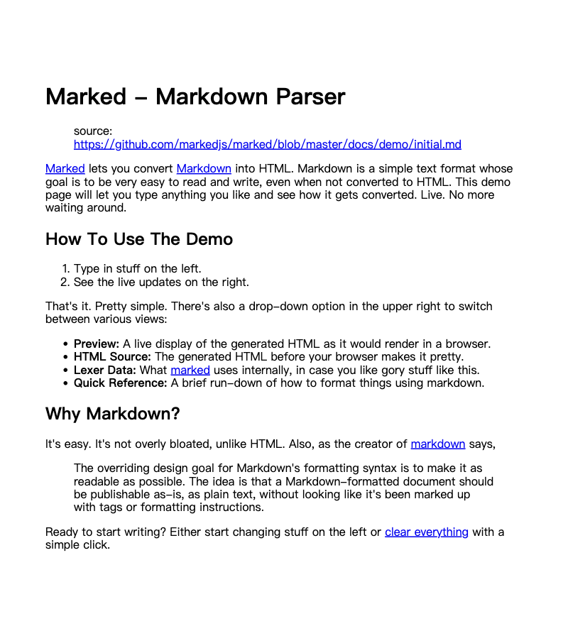
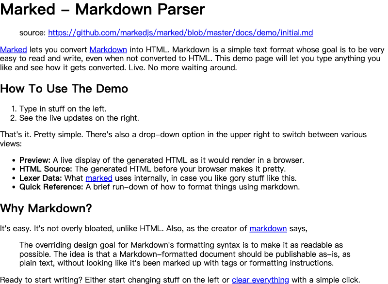
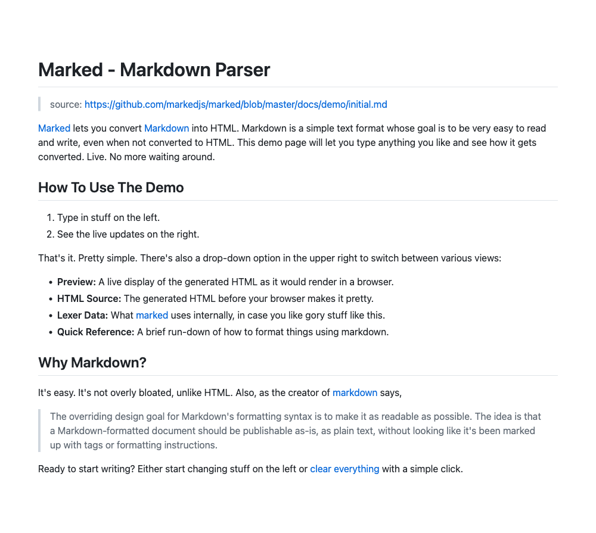
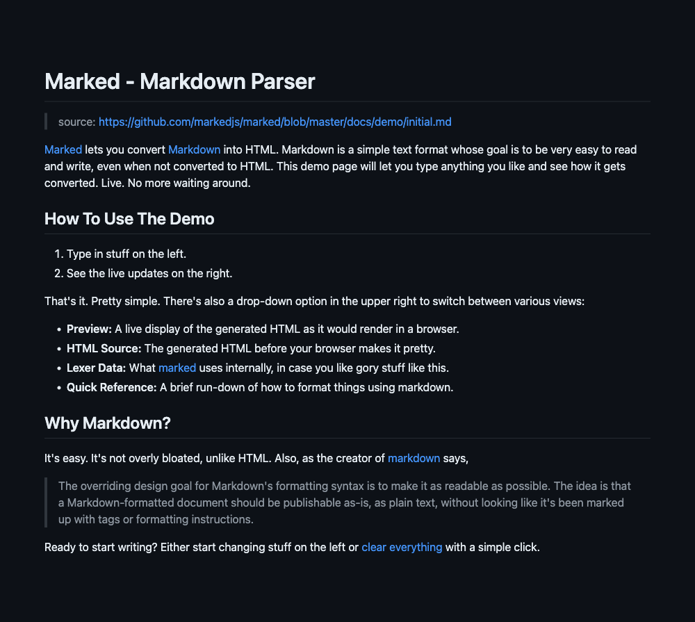

# mdimg

A tool that can be used to convert **Markdown** or **HTML** format text to an image.

## How does it work?

First, the script calls [marked](https://github.com/markedjs/marked) to parse Markdown into a HTML document. Next, use [Puppeteer](https://github.com/puppeteer/puppeteer) to start a headless browser and render the document with preset HTML and CSS files. Finally, export our image through Puppeteer's [screenshot](https://pptr.dev/#?product=Puppeteer&show=api-pagescreenshotoptions) API.

## Preview

Rendering results under MacOS:

| Preview                                                                  | HTML Template | CSS Template | Notes                                             |
| ------------------------------------------------------------------------ | ------------- | ------------ | ------------------------------------------------- |
|         | Default       | Default      |
|             | Default       | Empty        | Not using any CSS presets                         |
|           | Default       | Github       |
|  | Default       | Github Dark  |
|             | Words         | Words        | It is recommended to use with **plain text only** |

## Requirements

This tool requires a LTS Node version (v18.0.0+).

If your node version is lower than 18, please use the legacy version [0.2.3](https://www.npmjs.com/package/mdimg/v/0.2.3).

## Installation

CLI:

```bash
npm install -g mdimg
```

In Node.js project:

```bash
npm install mdimg
```

## Usage

### CLI

Example:

```bash
mdimg -i input.md -o output.png -w 600 --css github
```

mdimg will read text from `input.md` and convert it to an image file `output.png`.

When using the command, you must specify either `-i` (input file, recommended) or `-t` (directly input text).

When using `-t` to input Markdown text directly, escape characters will **not be available**. To fix this, for example, you should replace `\n` with `<br>`.

You can always call `mdimg -h` to get complete help.

### In Node.js project

Import mdimg to your project:

```js
const { convert2img } = require("mdimg");

// or use import
import { convert2img } from "mdimg";
```

Convert markdown text or file to image:

```js
const convertRes = await convert2img({
  mdFile: "path/to/input.md",
  outputFilename: "path/to/output.png",
  width: 600,
  cssTemplate: "github",
});

console.log(`Convert to image successfully!\nFile: ${convertRes.data}`);
```

When using `convert2img()` method, you must specify either `mdFile` (input file) or `mdText` (directly input text).

Options:

| Argument       | Type            | Default                                      | Notes                                                                                                                                               |
| -------------- | --------------- | -------------------------------------------- | --------------------------------------------------------------------------------------------------------------------------------------------------- |
| mdText         | `String`        | `undefined`                                  | Input Markdown or HTML text directly. This option **has no effect** if `mdFile` is specified                                                        |
| mdFile         | `String`        | `undefined`                                  | Read Markdown or HTML text from a file                                                                                                              |
| outputFilename | `String`        | `./mdimg_output/mdimg_${new Date()}.${type}` | Output binary image filename. File type can be `jpeg`, `png` or `webp`. Available when `encoding` option is `binary`                                |
| type           | `String`        | `png`                                        | The file type of the image. Type can be one of `jpeg`, `png` or `webp`, defaults to `png`. Type will be inferred from `outputFilename` if available |
| width          | `Number`        | `800`                                        | The width of output image                                                                                                                           |
| encoding       | `String`        | `binary`                                     | The encoding of output image. Available value can be `binary` or `base64`.                                                                          |
| quality        | `Number`        | `100`                                        | The quality of the image, between 0-100. **Not applicable** to `png` image.                                                                         |
| htmlTemplate   | `String`        | `default`                                    | HTML rendering template. Available templates can be found in `template/html`                                                                        |
| cssTemplate    | `String`        | `default`                                    | CSS rendering template. Available templates can be found in `template/css`                                                                          |
| log            | `Boolean`       | `false`                                      | Show preset console log                                                                                                                             |
| puppeteerProps | `LaunchOptions` | `undefined`                                  | [Launch options](https://pptr.dev/api/puppeteer.puppeteerlaunchoptions) of Puppeteer                                                                |

Returns: `Promise<object>`

| Key  | Value Type           | Notes                                                                                                     |
| ---- | -------------------- | --------------------------------------------------------------------------------------------------------- |
| data | `string` \| `Buffer` | Buffer (`encoding` is `binary`) or a BASE64 encoded string (`encoding` is `base64`) with the output image |
| path | `string`             | The path of output iamge. Available when `encoding` is `binary`                                           |
| html | `string`             | The rendered HTML document                                                                                |

## Custom template

Templates are stored in the `template` directory.

Now, if you run the following command:

```bash
mdimg -i input.md --html custom --css custom
```

The mdimg will read `custom.html` from `template/html` directory as HTML template and `custom.css` from `template/css` directory as CSS template to render the image of `input.md`.

### HTML template

Create a new `.html` file in `template/html` directory.

There is only one rule you need to follow: an element with id `mdimg-body` wrapping an element with class `markdown-body`.

The simplest example:

```html
<div id="mdimg-body">
  <div class="markdown-body" />
</div>
```

The mdimg will put the parsed HTML content in the element with class `markdown-body` (elements inside will be replaced), and finally generate the image for the whole element whose id is `mdimg-body`.

### CSS template

Create a new `.css` file in `template/css` directory and then make your style!

For further development, it is recommended that write `.scss` or `.sass` files in the `template/scss` directory, and use the following command to generate CSS templates:

```bash
# Build .scss and .sass files
npm run rollup:sass
```

CSS templates with the corresponding name will be generated in `template/css` directory.

## Development

```bash
git clone https://github.com/LolipopJ/mdimg.git
cd mdimg
yarn
# npm install
```

### Lint

```bash
# Check .js syntax only
npm run lint
# Check and fix syntax
npm run prettier
```

### Build

```bash
# Build .js, .scss and .sass files
npm run build
```

### Test

```bash
# Test CLI
node bin/mdimg -i test/test.md -o output.png
# Test node function
npm run test
```

## Inspired by

- [md2img](https://github.com/363797271/md2img). Provided me the idea and a complete feasible solution.
