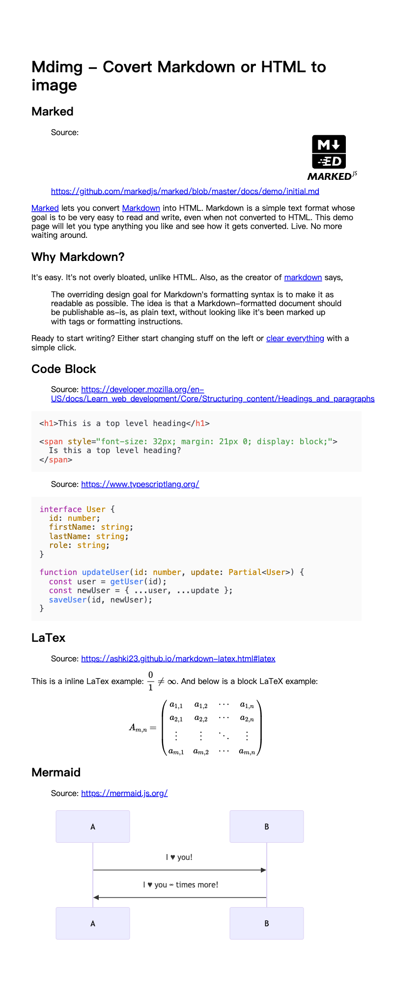
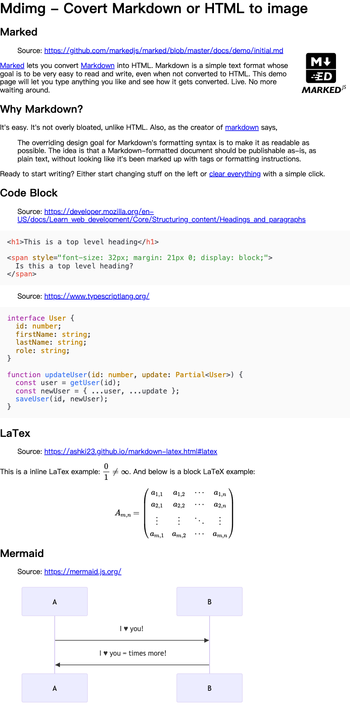
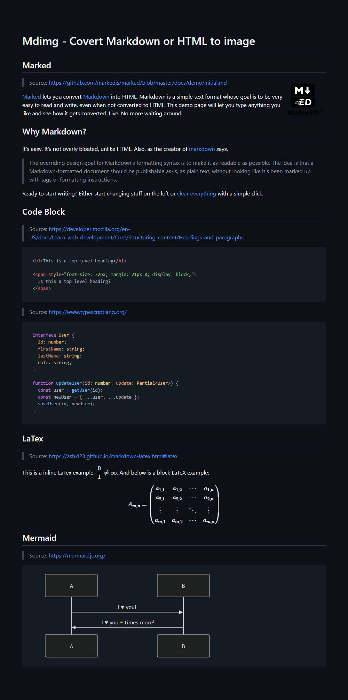

  

# mdimg

A tool that can be used to convert **Markdown** or **HTML** format text to an image.

## How does it work?

First, the script calls [marked](https://github.com/markedjs/marked) to parse Markdown into a HTML document. Next, use [Puppeteer](https://github.com/puppeteer/puppeteer) to start a headless browser and render the document with preset HTML and CSS files. Finally, export our image through Puppeteer's [screenshot](https://pptr.dev/#?product=Puppeteer&show=api-pagescreenshotoptions) API.

## Preview

Rendering results:

| MacOS                                                                           | Windows                                                                        | HTML Template | CSS Template | Notes                                             |
| ------------------------------------------------------------------------------- | ------------------------------------------------------------------------------ | ------------- | ------------ | ------------------------------------------------- |
|         |         | `default`     | `default`    |
|             |             | `default`     | `empty`      | Not using any CSS presets                         |
|           |           | `default`     | `github`     |
|  |  | `default`     | `githubDark` |
|             |             | `words`       | `words`      | It is recommended to use with **plain text only** |

## Requirements

This tool requires a LTS Node version (v18.0.0+).

If your node version is lower than 18, please use the legacy version [0.2.3](https://www.npmjs.com/package/mdimg/v/0.2.3).

## Installation

CLI:

```bash
npm install -g mdimg
```

In Node.js project:

```bash
npm install mdimg
```

## Usage

### CLI

Example:

```bash
mdimg -i input.md -o output.png -w 600 --css github
```

mdimg will read text from `input.md` and convert it to an image file `output.png`.

When using the command, you must specify either `-i` (input file, recommended) or `-t` (directly input text).

When using `-t` to input Markdown text directly, escape characters will **not be available**. To fix this, for example, you should replace `\n` with `<br>`.

You can always call `mdimg -h` to get complete help.

### In Node.js project

Import mdimg to your project:

```js
const { mdimg } = require("mdimg");

// or use import
import { mdimg } from "mdimg";
```

Convert markdown file to an image:

```js
const convertRes = await mdimg({
  inputFilename: "path/to/input.md",
  outputFilename: "path/to/output.png",
  width: 600,
  cssTemplate: "github",
});

console.log(
  `Convert to image successfully!\nImage has been saved as \`${convertRes.path}\``,
);
```

Convert markdown text to blob:

```js
const convertRes = await mdimg({
  inputText: "# Hello world",
  encoding: "blob",
});

// import { writeFileSync } from "fs";
// writeFileSync("path/to/output.png", convertRes.data);
```

When using `mdimg()` method, you must specify either `inputFilename` (input file) or `inputText` (directly input text).

Here are all available options:

| Argument       | Type            | Default                                      | Notes                                                                                                                                                    |
| -------------- | --------------- | -------------------------------------------- | -------------------------------------------------------------------------------------------------------------------------------------------------------- |
| inputText      | `String`        | `undefined`                                  | Input Markdown or HTML text directly. This option **has no effect** if `inputFilename` is specified                                                      |
| inputFilename  | `String`        | `undefined`                                  | Read Markdown or HTML text from a file                                                                                                                   |
| outputFilename | `String`        | `./mdimg_output/mdimg_${new Date()}.${type}` | Output binary image filename. Available file extensions: `jpeg`, `png`, `webp`. Available when `encoding` option is `binary`                             |
| type           | `String`        | `png`                                        | File type of the image. Available types: `jpeg`, `png`, `webp`, defaults to `png`. Type will be inferred from `outputFilename` if specified              |
| width          | `Number`        | `800`                                        | Width of output image                                                                                                                                    |
| encoding       | `String`        | `binary`                                     | Encode type of output image. Available types: `base64`, `binary`, `blob`                                                                                 |
| quality        | `Number`        | `100`                                        | Quality of the image, between 0-100. **Not applicable** to `png` image                                                                                   |
| htmlText       | `String`        | `undefined`                                  | HTML rendering text                                                                                                                                      |
| cssText        | `String`        | `undefined`                                  | CSS rendering text                                                                                                                                       |
| htmlTemplate   | `String`        | `default`                                    | HTML rendering template. Available presets can be found in [`template/html`](./template/html/). This option **has no effect** if `htmlText` is specified |
| cssTemplate    | `String`        | `default`                                    | CSS rendering template. Available presets can be found in [`template/css`](./template/css/). This option **has no effect** if `cssText` is specified     |
| log            | `Boolean`       | `false`                                      | Print execution logs via stderr                                                                                                                          |
| puppeteerProps | `LaunchOptions` | `undefined`                                  | [Launch options](https://pptr.dev/api/puppeteer.puppeteerlaunchoptions) of Puppeteer                                                                     |

Returns: `Promise<object>`

| Key  | Value Type               | Notes                                                                                                                    |
| ---- | ------------------------ | ------------------------------------------------------------------------------------------------------------------------ |
| data | `string` \| `Uint8Array` | BASE64 encoded string (`encoding` is `base64`) or Uint8Array blob (`encoding` is `binary` or `blob`) of the output image |
| path | `string`                 | Path of output image. Available when `encoding` is `binary`                                                              |
| html | `string`                 | Rendered HTML document                                                                                                   |

## Custom template

> **😍 Contribute to preset templates via [pull requests](https://github.com/LolipopJ/mdimg/pulls) is welcomed!**

Preset templates are stored in the `template` directory.

If you execute the following command:

```bash
mdimg -i input.md --html custom --css custom
```

Or in Node.js project:

```js
await mdimg({
  inputFilename: "input.md",
  htmlTemplate: "custom",
  cssTemplate: "custom",
});
```

The mdimg will read `custom.html` from `template/html` directory as HTML template and `custom.css` from `template/css` directory as CSS template to render the image of `input.md`.

### HTML template

Create a new `.html` file in `template/html` directory.

There is only one rule you need to follow: an element with id `mdimg-body` wrapping an element with class `markdown-body`.

The simplest example:

```html
<div id="mdimg-body">
  <div class="markdown-body" />
</div>
```

The mdimg will put the parsed HTML content in the element with class `markdown-body` (elements inside will be replaced), and finally generate the image for the whole element whose id is `mdimg-body`.

### CSS template

Nothing to note, create a new `.css` file in `template/css` directory and then make your style!

For further development, it is recommended that write `.scss` or `.sass` files in the `template/scss` directory, and use the following command to generate CSS templates:

```bash
# Build .scss and .sass files
yarn rollup:sass
```

CSS templates with the corresponding name will be generated in `template/css` directory.

## Intake template directly

Preset templates may not often meet your needs. If you already know the specifications of [HTML template](#html-template) and [CSS template](#css-template), you can pass the template string directly.

A command example:

```bash
mdimg -i input.md --htmlText '<div id="mdimg-body"><div class="markdown-body"></div></div>' --cssText '@import "https://cdn.jsdelivr.net/npm/normalize.css/normalize.min.css"; .markdown-body { padding: 6rem 4rem; }'
```

Or in Node.js project:

```js
await mdimg({
  inputFilename: "input.md",
  htmlText: `<div id="mdimg-body">
  <div class="markdown-body"></div>
</div>`,
  cssText: `@import "https://cdn.jsdelivr.net/npm/normalize.css/normalize.min.css";
.markdown-body {
  padding: 6rem 4rem;
}`,
});
```

## Development

```bash
git clone https://github.com/LolipopJ/mdimg.git
cd mdimg
yarn
```

### Lint

```bash
# Check lint rules
yarn lint
# Check lint rules and fix resolvable errors
yarn lint:fix
```

### Build

```bash
# Build .js, .scss and .sass files
yarn build
```

### Test

```bash
# Build productions before testing
yarn build
# Run test cases
yarn test
```

## Inspired by

- [md2img](https://github.com/363797271/md2img). Provided me the idea and a complete feasible solution.
