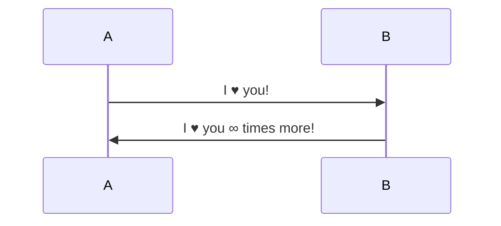

# Marked - Markdown Parser

> Source: https://github.com/markedjs/marked/blob/master/docs/demo/initial.md

[Marked] lets you convert [Markdown] into HTML. Markdown is a simple text format whose goal is to be very easy to read and write, even when not converted to HTML. This demo page will let you type anything you like and see how it gets converted. Live. No more waiting around.

## How To Use The Demo

1. Type in stuff on the left.
2. See the live updates on the right.

That's it. Pretty simple. There's also a drop-down option in the upper right to switch between various views:

- **Preview:** A live display of the generated HTML as it would render in a browser.
- **HTML Source:** The generated HTML before your browser makes it pretty.
- **Lexer Data:** What [marked] uses internally, in case you like gory stuff like this.
- **Quick Reference:** A brief run-down of how to format things using markdown.

## Why Markdown?

It's easy. It's not overly bloated, unlike HTML. Also, as the creator of [markdown] says,

> The overriding design goal for Markdown's
> formatting syntax is to make it as readable
> as possible. The idea is that a
> Markdown-formatted document should be
> publishable as-is, as plain text, without
> looking like it's been marked up with tags
> or formatting instructions.

Ready to start writing? Either start changing stuff on the left or
[clear everything](/demo/?text=) with a simple click.

[marked]: https://github.com/markedjs/marked/
[markdown]: http://daringfireball.net/projects/markdown/

## Code Block

> Source: https://www.typescriptlang.org/

```ts
interface User {
  id: number;
  firstName: string;
  lastName: string;
  role: string;
}

function updateUser(id: number, update: Partial<User>) {
  const user = getUser(id);
  const newUser = { ...user, ...update };
  saveUser(id, newUser);
}
```

## LaTex

> Source: https://ashki23.github.io/markdown-latex.html#latex

This is a inline LaTex example: $\dfrac{0}{1} \neq \infty$. And below is a block LaTeX example:

<div>$$
A_{m,n} =
\begin{pmatrix}
a_{1,1} & a_{1,2} & \cdots & a_{1,n} \\
a_{2,1} & a_{2,2} & \cdots & a_{2,n} \\
\vdots & \vdots & \ddots & \vdots \\
a_{m,1} & a_{m,2} & \cdots & a_{m,n}
\end{pmatrix}
$$</div>

## Mermaid

> Source: https://mermaid.js.org/


